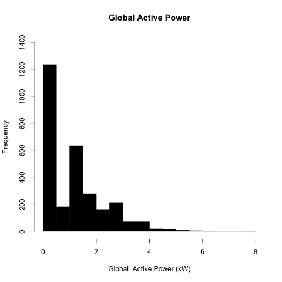
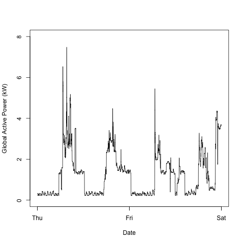
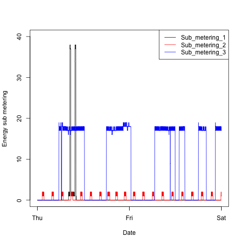
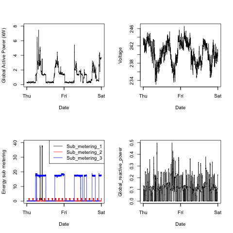

Solution
========
This directory contains four plots, `plot[1-4].png`, which are
created by the corresponding R scripts `plot[1-4].R`.

### Running the Code ###
The scripts expect the file `data/household_power_trimmed.txt`, which
is a copy of `household_power_consumption.txt` [1] which has been
trimmed down to only include data points from 2/1/2007-2/2/2007.

Each script has a function `make.plotN` where `N` is a number from
1-4, corresponding to the plot.

[1] Available from UCI, https://archive.ics.uci.edu/ml/datasets/Individual+household+electric+power+consumption
